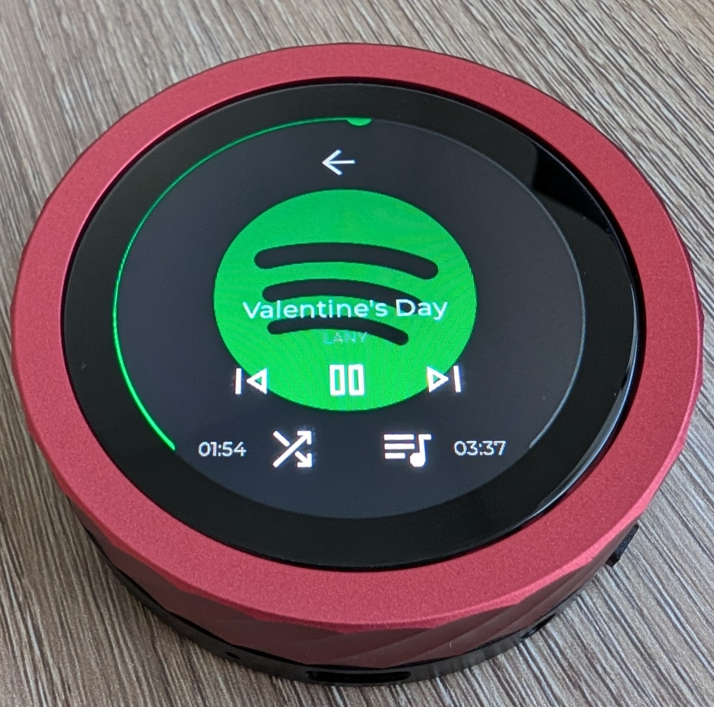

# 🎵 ESP32 Spotify App

This project allows you to control spotify remotely via the [Spotify Web API](https://developer.spotify.com/documentation/web-api) from an ESP32. This
project is specifically designed around the [WaveShare ESP32 Knob](https://www.waveshare.com/wiki/ESP32-S3-Knob-Touch-LCD-1.8). The project allows
you to play, pause, skip, shuffle, track seek, play and view playlists, and add songs to the spotify queue.



---

## Getting Started

To start build the project and flash the device.

1. Download and install the [esp-idf vscode extension](https://www.waveshare.com/wiki/Install_Espressif_IDF_Plugin_Tutorial) and open this project.
2. Connect the ESP32 device to your computer via the USB-C connection. Note the WaveShare Knob device has 2 ESP32 chips in it and the orientation you
connect the USB is how you select which one is connected. This project runs on the ESP32S3 chip in thie device. When you attach the USB-C it will
enumerate a virtual serial port (on linux it will typically enmerate as `/dev/ttyACM0`)
3. At the bottom of the vscode window you will want to select the `ESP-IDF: Build, Flash and Monitor` icon (this can also be acomplished with the
`ctrl+E, D` shortcut).


Then you will need to connect the device to wifi:

1. Power on the flash-ed device and plug it into your computer.
2. Select the monitor device icon at the bottom of the vs-code window (or use the shortcut `ctrl+E, M`).
3. In the monitor window type the command `param set wifi_ssid <your_wifi_ssid>`, and `param set wifi_password <your_wifi_password>`
4. Then run the command `reboot`
5. In your monitor window you will see it go through a boot cycle again, and now you should see the wifi ssid you entered in the params as well as
some asterisks equal to the length of the password. you entered.
```
**************************** Params ***************************
wifi_ssid = <your_wifi_ssid>
wifi_password = *************
client_id =
client_secret =
user1_name =
user1_token =
user1_refresh =
***************************************************************
```
6. If the wifi connection is successfull you should see a `WIFI_EVENT_STA_CONNECTED` connected event in the monitor terminal along with a `STA_GOT_IP`
event and the IP address the device was assigned.
```
I (7550) WIFI: WIFI_EVENT_STA_CONNECTED
I (7602) wifi:AP's beacon interval = 102400 us, DTIM period = 1
I (11222) wifi:<ba-add>idx:0 (ifx:0, 0e:ea:14:2b:4a:d2), tid:6, ssn:1, winSize:64
I (11225) wifi:<ba-add>idx:1 (ifx:0, 0e:ea:14:2b:4a:d2), tid:0, ssn:0, winSize:64
I (12207) esp_netif_handlers: sta ip: 192.168.2.23, mask: 255.255.255.0, gw: 192.168.2.1
I (12208) WIFI: STA_GOT_IP:192.168.2.23
```
---

Lastly you will need to link your spotify account: (Placeholder until the account pairing feature is implemented)

1. Get your spotify client ID public and secret keys
2. Generate a token and refresh token for with full access to your spotify account
3. Enter these 4 values into the param system on your device.
4. Reboot your device.
5. These values will show up in your param system on boot, but can also be viewed with the `param list` command. Note sensitive tokens and keys will
appear as asterisks.
```
**************************** Params ***************************
wifi_ssid = <your_wifi_ssid>
wifi_password = **************
client_id = <your_client_id>
client_secret = ********************************
user1_name = <your_name>
user1_token = **************************************************
user1_refresh = **************************************************
***************************************************************
```

# Console Interface

This application has an integrated device console with several helpful debugging commands implemented.

* Help
```
heap
  Show heap information

help  [<string>] [-v <0|1>]
  Print the summary of all registered commands if no arguments are given,
  otherwise print summary of given command.
      <string>  Name of command
  -v, --verbose=<0|1>  If specified, list console commands with given verbose level

light_sleep  <type>
  Config light sleep mode
        <type>  light sleep mode: enable

param  <action> [<name>] [<value>]
  param command: 'list', 'read', 'save', 'erase', 'default', or 'set <name>
  <value>'
      <action>  'list', 'read', 'save', 'erase', 'default', or 'set'
        <name>  Parameter name (used with 'set')
       <value>  Parameter value (used with 'set')

ping  <host>
  send ICMP ECHO_REQUEST to network hosts
        <host>  Host address

reboot
  Reboots the ESP32

spotify  <action>
  spotify command: 'status', 'play', 'pause', 'next', 'previous', 'shuffle',
  'update', 'refreshToken', 'repeat'
      <action>  Spotify action: 'play', 'pause', 'next', 'previous', 'status', 'shuffle', 'repeat'

sta_connect  <ssid> [<pass>] [-n <channel>]
  WiFi is station mode, join specified soft-AP
        <ssid>  SSID of AP
        <pass>  password of AP
  -n, --channel=<channel>  channel of AP

top
  Show task information
```

* Reboot `reboot`. Does a system reset on the ESP32

* Task stats `top`
```
spotify> top
+----------------------+---------+----------+-------------+----------+-----------+
| Task Name            | Util(%) | Total(%) | HighWater   | Priority | State     |
+----------------------+---------+----------+-------------+----------+-----------+
| IDLE0                |   90.8% |    90.2% |         628 |        0 | Ready     |
| IDLE1                |   78.0% |    81.3% |         636 |        0 | Ready     |
| spotifyTask          |   21.8% |    19.6% |        6092 |        5 | Blocked   |
| LVGL                 |    3.6% |     3.7% |        5336 |        2 | Blocked   |
| wifi                 |    1.7% |     1.6% |        3344 |       23 | Blocked   |
| esp_timer            |    1.6% |     1.6% |        2960 |       22 | Suspended |
| tiT                  |    1.1% |     1.0% |        1816 |       18 | Blocked   |
| ui_update_task       |    0.8% |     0.8% |        6304 |        5 | Blocked   |
| console_repl         |    0.5% |     0.0% |        5936 |        2 | Running   |
| sys_evt              |    0.1% |     0.1% |         432 |       20 | Blocked   |
| ipc1                 |    0.0% |     0.0% |         536 |       24 | Suspended |
| main                 |    0.0% |     0.0% |        5580 |        1 | Suspended |
| ipc0                 |    0.0% |     0.0% |         528 |       24 | Suspended |
| user_encoder_lo      |    0.0% |     0.0% |        7488 |        2 | Blocked   |
| Tmr Svc              |    0.0% |     0.0% |        1364 |        1 | Blocked   |
+----------------------+---------+----------+-------------+----------+-----------+
```

* Heap tracing
```
spotify> heap
I (8604) HeapInfo: Free heap: 36256 bytes
I (8605) HeapInfo: Minimum free heap since boot: 17292 bytes
I (8606) HeapInfo: Largest free block: 22528 bytes
```

* ping
```
spotify> ping 192.168.1.80
I (340988) WIFI: Pinging Peer with IPv6 addr 192.168.1.80
I (341038) WIFI: 64 bytes from 192.168.1.80 icmp_seq=1 ttl=63 time=47 ms
I (342259) WIFI: 64 bytes from 192.168.1.80 icmp_seq=2 ttl=63 time=267 ms
I (343487) WIFI: 64 bytes from 192.168.1.80 icmp_seq=3 ttl=63 time=497 ms
I (344197) WIFI: 64 bytes from 192.168.1.80 icmp_seq=4 ttl=63 time=206 ms
I (345111) WIFI: 64 bytes from 192.168.1.80 icmp_seq=5 ttl=63 time=120 ms
I (345990) WIFI:
--- 192.168.1.80 ping statistics ---
I (345990) WIFI: 5 packets transmitted, 5 received, 0% packet loss, time 1137ms
```

* sta_connect
* light_sleep
* Spotify
    ```
    Spotify command usage:
      spotify <action>
        action: 'play', 'pause', 'next', 'previous', 'status', 'shuffle', 'update', 'getQueue', 'refreshToken', 'userInfo', 'getPlaylists', 'repeat'
    ```
    * Each `spotify` sub command that is run will put the Spotify client into verbose mode for the duration of the test command. This will make the ESP32
    display the raw json responses from the Spotify Web API to the console and can be useful for debugging.
    * Status `spotify status`
    * Play song `spotify play`
    * Pause song `spotify pause`
    * Next song `spotify next`
    * Previous song `spotify previous`
    * Shuffle current playlist `spotify shuffle`
    * Repeat `spotify repeat`
    * Update current song and player status `spotify update`
    * Refresh Token `spotify refreshToken`
* Param Console Command
    * List all parameters `param list`
    ```
    spotify> param list
    **************************** Params ***************************
    wifi_ssid = K2
    wifi_password = **************
    client_id = 9ffbd5c2fd4dgf2fdsasdf91dced28c9
    client_secret = ********************************
    user1_name = Parker
    user1_token = **************************************************
    user1_refresh = **************************************************
    ***************************************************************
    ```
    * Set a parameter `spotify> param set <param_name> <value>`

    ```
    spotify> param set wifi_ssid MyWiFi
    spotify> param set wifi_password MySecretPass
    ```

    * Save Parameters `spotify> param save <param_name>`. This command indicates that the named param should be updated in memory. If no param name is given it will save all params to memory.

    * Erase Parameters `spotify> param erase <param_name>`. This command indicates that the named param should be erased from memory. If no param name is given it will erase all params to memory.


## 🧩 Example Console Session
```
I (566) pp: pp rom version: e7ae62f
I (567) net80211: net80211 rom version: e7ae62f
I (569) wifi:wifi driver task: 3fcb71f4, prio:23, stack:6656, core=0
I (580) wifi:wifi firmware version: 14da9b7
I (581) wifi:wifi certification version: v7.0
I (581) wifi:config NVS flash: enabled
I (581) wifi:config nano formatting: disabled
I (581) wifi:Init data frame dynamic rx buffer num: 32
I (581) wifi:Init static rx mgmt buffer num: 5
I (582) wifi:Init management short buffer num: 32
I (582) wifi:Init static tx buffer num: 16
I (582) wifi:Init static tx FG buffer num: 2
I (582) wifi:Init static rx buffer size: 1600
I (583) wifi:Init static rx buffer num: 10
I (583) wifi:Init dynamic rx buffer num: 32
I (584) wifi_init: rx ba win: 6
I (584) wifi_init: accept mbox: 6
I (584) wifi_init: tcpip mbox: 32
I (584) wifi_init: udp mbox: 6
I (585) wifi_init: tcp mbox: 6
I (585) wifi_init: tcp tx win: 5744
I (585) wifi_init: tcp rx win: 5744
I (585) wifi_init: tcp mss: 1440
I (585) wifi_init: WiFi IRAM OP enabled
I (585) wifi_init: WiFi RX IRAM OP enabled
I (586) phy_init: phy_version 701,f4f1da3a,Mar  3 2025,15:50:10

I (624) wifi:mode : sta (fc:01:2c:d1:ef:9c)
I (625) wifi:enable tsf
I (625) WIFI: WiFi event: 0x2b
I (626) wifi:Set ps type: 1, coexist: 0

I (627) WIFI: WiFi event: 0x2
I (627) WIFI: initialize_wifi DONE.
I (629) WIFI: Connecting to K2...
I (645) WIFI: WIFI_CONNECT_START, ret: 0x0
I (646) main: Starting Spotify App

I (648) display_init: Initialize SPI bus
I (649) display_init: Install panel IO
I (651) display_init: Install SH8601 panel driver
I (652) sh8601: LCD panel create success, version: 1.0.0
spotify> W (940) sh8601: The 36h command has been used and will be overwritten by external initialization sequence
I (942) display_init: Register display driver to LVGL
I (947) display_init: Install LVGL tick timer
I (948) display_init: Starting LVGL task
I (1065) Knob: Iot Knob Config Succeed, encoder A:8, encoder B:7
W (1066) wifi:Haven't to connect to a suitable AP now!
**************************** Params ***************************
wifi_ssid = K2
wifi_password = **************
client_id = 9aebd5c245f3425e82263b91dced28c9
client_secret = ********************************
user1_name = Parker
user1_token = **************************************************
user1_refresh = **************************************************
***************************************************************
W (1072) wifi:Haven't to connect to a suitable AP now!
W (2066) wifi:Haven't to connect to a suitable AP now!
W (2072) wifi:Haven't to connect to a suitable AP now!
I (3129) wifi:new:<6,0>, old:<1,0>, ap:<255,255>, sta:<6,0>, prof:1, snd_ch_cfg:0x0
I (3131) wifi:state: init -> auth (0xb0)
I (3134) WIFI: WiFi event: 0x2b
I (3136) wifi:state: auth -> assoc (0x0)
I (3148) wifi:state: assoc -> run (0x10)
I (3167) wifi:connected with K2, aid = 19, channel 6, BW20, bssid = 0e:ea:14:2b:38:da
I (3169) wifi:security: WPA2-PSK, phy: bgn, rssi: -54
I (3173) wifi:pm start, type: 1

I (3173) wifi:dp: 1, bi: 102400, li: 3, scale listen interval from 307200 us to 307200 us
I (3175) wifi:set rx beacon pti, rx_bcn_pti: 0, bcn_timeout: 25000, mt_pti: 0, mt_time: 10000
I (3177) WIFI: WiFi event: 0x4
I (3178) WIFI: WIFI_EVENT_STA_CONNECTED
I (3180) wifi:AP's beacon interval = 102400 us, DTIM period = 1
I (3195) wifi:<ba-add>idx:0 (ifx:0, 0e:ea:14:2b:38:da), tid:6, ssn:1, winSize:64
I (3201) wifi:<ba-add>idx:1 (ifx:0, 0e:ea:14:2b:38:da), tid:0, ssn:0, winSize:64
I (4199) esp_netif_handlers: sta ip: 192.168.2.23, mask: 255.255.255.0, gw: 192.168.2.1
I (4201) WIFI: STA_GOT_IP:192.168.2.23
spotify>
```


# Squareline Studio UI Project
The UI files were generated by the squareline studio's project in `sq_tudio_prj/`. To modify these files install the latest version of squareline studio and then open the project. After making any changes to the UI select `Export -> Export UI Files`. This will automatically generate the files LVGL files and put them in `components/ui/generated/`. Then simply build the project and flash the device again to get the update UI on the device.

Note: there are some dynamic UI elements which, if updated, need to be manually copied into the correct location in the code. Specifically these elements are the
list rows which display the individual songs in a playlist or in the queue, or display a list of playlists you can select. If these are modified then some of the
generated code will need to be coppied into the class constructors in `components/spotify/SpotifyPlaylistItem.cpp`, `components/spotify/SpotifyPlaylist.cpp`, and
`components/spotify/SpotifyQueueItem.cpp`.
